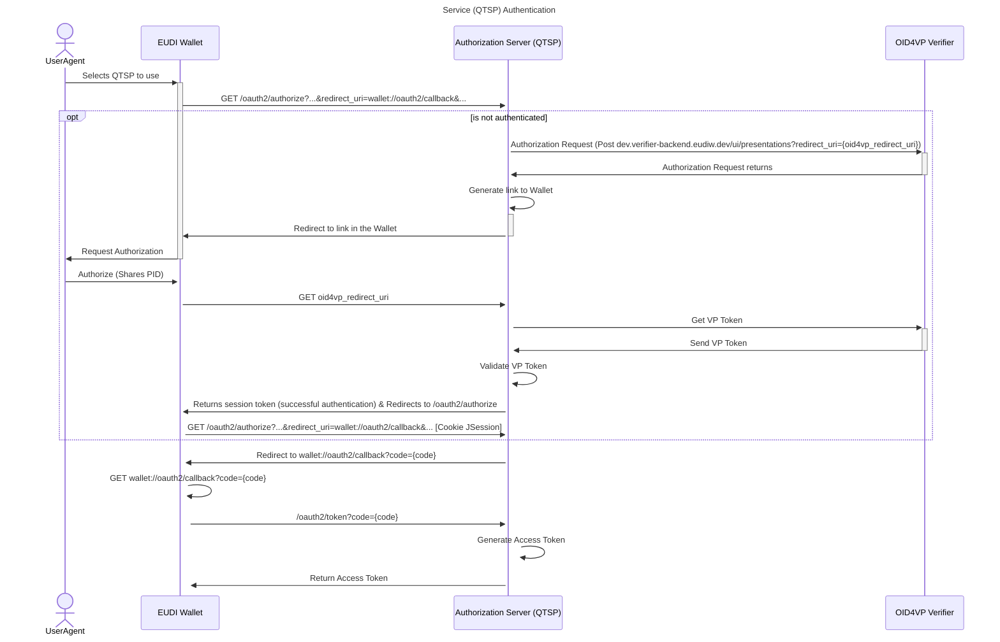
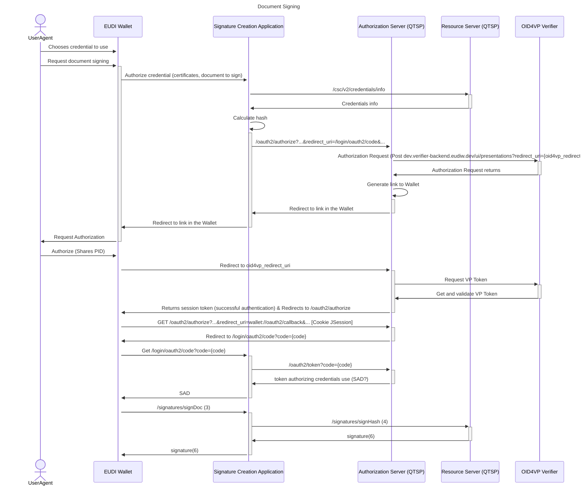

# eudi-srv-web-walletdriven-signer-qtsp-java
rQES R3 QTSP

## Sequence Diagrams

### Service Authentication

### Credential Authorization

## Deployment

### Authorization Server

1. Define the application-auth file
2. Define the application-client-registration
3. Create Database and the user with the required permissions
4. Create the tables:
   https://github.com/spring-projects/spring-authorization-server/blob/main/oauth2-authorization-server/src/main/resources/org/springframework/security/oauth2/server/authorization/client/oauth2-registered-client-schema.sql
   https://github.com/spring-projects/spring-authorization-server/blob/main/oauth2-authorization-server/src/main/resources/org/springframework/security/oauth2/server/authorization/oauth2-authorization-schema.sql
   https://github.com/spring-projects/spring-authorization-server/blob/main/oauth2-authorization-server/src/main/resources/org/springframework/security/oauth2/server/authorization/oauth2-authorization-consent-schema.sql

### Resource Server

1. Define the application-auth file
2. Define the application-ejbca file
3. Create Database and the user with the required permissions
4. Configure the HSM
