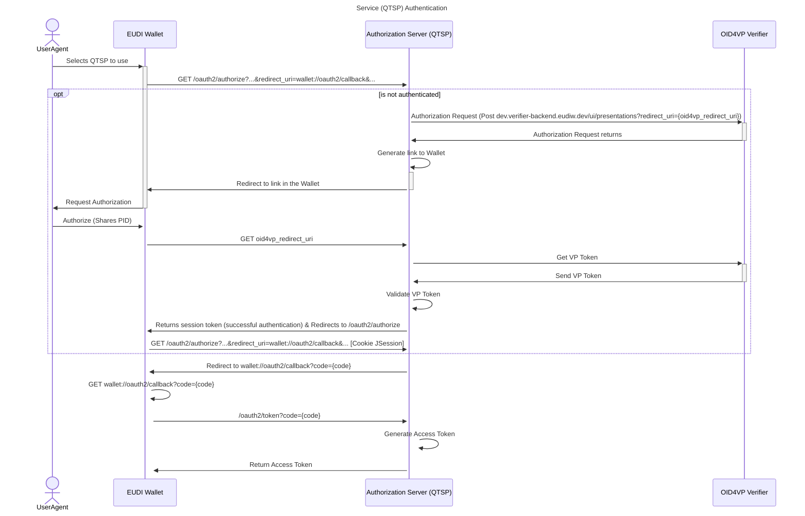
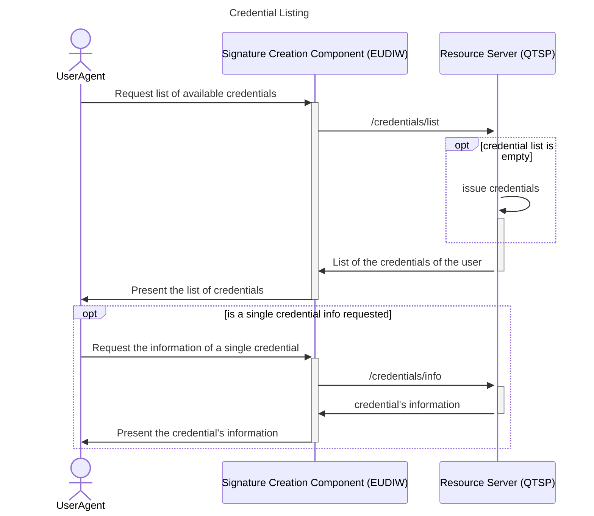
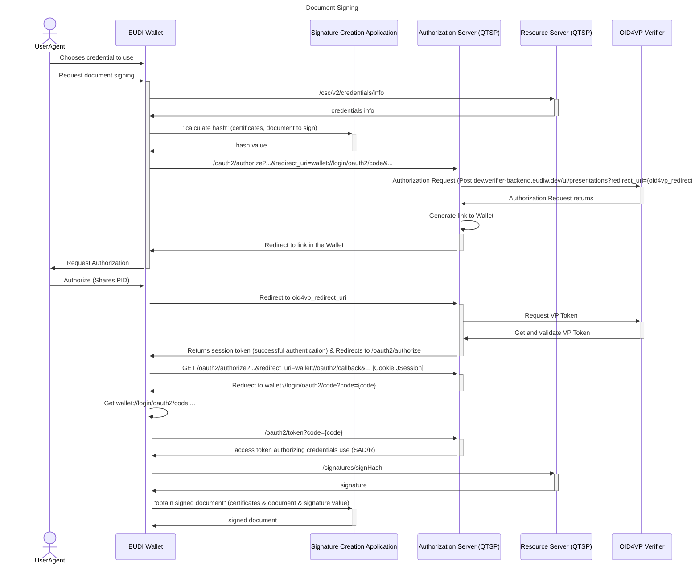

# EUDI Wallet-driven signer QTSP

](https://www.apache.org/licenses/LICENSE-2.0)

:heavy_exclamation_mark: **Important!** Before you proceed, please read
the [EUDI Wallet Reference Implementation project description](https://github.com/eu-digital-identity-wallet/.github/blob/main/profile/reference-implementation.md)


## Table of contents

- [EUDI Wallet-driven signer QTSP](#eudi-wallet-driven-signer-qtsp)
  - [Table of contents](#table-of-contents)
  - [Overview](#overview)
  - [Disclaimer](#disclaimer)
  - [Sequence Diagrams](#sequence-diagrams)
    - [Service Authentication](#service-authentication)
    - [Credentials Listing](#credentials-listing)
    - [Credential Authorization](#credential-authorization)
  - [Endpoints](#endpoints)
  - [Deployment](#deployment)
    - [Requirements](#requirements)
    - [Common Tools](#common-tools)
    - [Authorization Server (AS)](#authorization-server-as)
    - [Resource Server (RS)](#resource-server-rs)
  - [How to contribute](#how-to-contribute)
  - [License](#license)
    - [Third-party component licenses](#third-party-component-licenses)
    - [License details](#license-details)


## Overview

This is a REST API server that implements a wallet-driven QTSP for the remote Qualified Electronic Signature component of the EUDI Wallet.
The QTSP provides endpoints based on the CSC API v2.0 specification and supports authentication via OpenID4VP.

Currently, the server is running at "https://walletcentric.signer.eudiw.dev", but you can [deploy](#deployment) it in your environment.

The Wallet Centric rQES Specification can be found [here](docs/rqes-walledriven.md).

## Disclaimer

The released software is an initial development release version:

-   The initial development release is an early endeavor reflecting the efforts of a short timeboxed
    period, and by no means can be considered as the final product.
-   The initial development release may be changed substantially over time, might introduce new
    features but also may change or remove existing ones, potentially breaking compatibility with your
    existing code.
-   The initial development release is limited in functional scope.
-   The initial development release may contain errors or design flaws and other problems that could
    cause system or other failures and data loss.
-   The initial development release has reduced security, privacy, availability, and reliability
    standards relative to future releases. This could make the software slower, less reliable, or more
    vulnerable to attacks than mature software.
-   The initial development release is not yet comprehensively documented.
-   Users of the software must perform sufficient engineering and additional testing in order to
    properly evaluate their application and determine whether any of the open-sourced components is
    suitable for use in that application.
-   We strongly recommend not putting this version of the software into production use.
-   Only the latest version of the software will be supported

## Sequence Diagrams

### Service Authentication


### Credentials Listing


### Credential Authorization



## Endpoints

The endpoints presented below are based on the CSC API v2.0 specifications.

* /oauth2/authorize
* /oauth2/token
* /csc/v2/info
* /csc/v2/credentials/list
* /csc/v2/credentials/info
* /csc/v2/signatures/signHash

## Deployment

### Requirements
* Java version 17
* Apache Maven 3.6.3
* MySQL

### Common Tools

1. **Create the application-crypto.yml file**

The **application-crypto.yml** file must be created in the **common_tools/src/main/resources** folder.
    
```
symmetric-secret-key: # a BASE64-encoded value of an AES secret key
```

This secret key is required to encode certain values in JWT tokens.

### Authorization Server (AS)

1. **Create the application-auth.yml file**

   It is required to create an **application-auth.yml** file in the folder **authorization_server/src/main/resources**. 
   This file allows to define the access credentials of a user of the database for this server. The file should follow the format:

   ```
   auth:
      datasourceUsername: # the username of the database user, with permissions to the define database
      datasourcePassword: # the password of the database user, with permissions to the define database
   ```

2. **Create the application-client-registration.yml file**

   It is required to create an **application-client-registration.yml** file in the folder **authorization_server/src/main/resources**.
   This file allows to define the OAuth2.0 client of the Authorization Server. This file should follow the format:

   ```
   authorizationserver:
      client:
         {client-id}:
            registration:
               client-id: "{client-id}"
               client-secret: "{noop}{client-secret}"
               client-authentication-methods:
                  - "client_secret_basic"
               authorization-grant-types:
                  - "authorization_code"
               redirect-uris:
                  - "{redirect-uris}"
               scopes:
                  - "service"
                  - "credential"
               require-authorization-consent: false

         {client-id}:
            registration:
               client-id: "{client-id}"
               client-secret: "{noop}{client-secret}"
               client-authentication-methods:
                  - "client_secret_basic"
               authorization-grant-types:
                  - "authorization_code"
               redirect-uris:
                  - "{redirect-uris}"
               scopes:
                  - "service"
                  - "credential"
               require-authorization-consent: false
   ```

3. **Create database and user with the required permissions**

   The current program uses a MySQL database. To run it locally, it is necessary to have a MySQL server running. If you're using Ubuntu or a Debian-based system, you can install and start MySQL with the following commands:

   ```
   sudo apt install mysql-server -y
   sudo systemctl start mysql.service
   ```

   After installing MySQL, create a database and a new user:

   ```
   CREATE DATABASE {database_name};
   CREATE USER {username}@{ip} IDENTIFIED BY {password};
   GRANT ALL PRIVILEGES ON *.* TO {username}@{ip};
   ```

   Replace {ip} with the appropriate IP address or hostname of the AS component, {username} with the username of the user you wish to create, {password} with the password of the user, and {database_name} with the database to be created. If the AS program and the database run on the same system, use 'localhost' instead of the IP address:

   ```
   CREATE USER {username}@'localhost' IDENTIFIED BY {password};
   GRANT ALL PRIVILEGES ON *.* TO {username}@'localhost';
   ```

   Lastly, don't forget to set the username and the password of the user created in the **application-auth.yml**,
   and to set the database name in the **application.yml**.

4. **Create tables in the database**
   
   There are a few tables that are required to be defined to use the OAuth2.0 from Spring Boot, that need to be created in the previously created database. The tables are:
   * https://github.com/spring-projects/spring-authorization-server/blob/main/oauth2-authorization-server/src/main/resources/org/springframework/security/oauth2/server/authorization/client/oauth2-registered-client-schema.sql
   * https://github.com/spring-projects/spring-authorization-server/blob/main/oauth2-authorization-server/src/main/resources/org/springframework/security/oauth2/server/authorization/oauth2-authorization-schema.sql
   * https://github.com/spring-projects/spring-authorization-server/blob/main/oauth2-authorization-server/src/main/resources/org/springframework/security/oauth2/server/authorization/oauth2-authorization-consent-schema.sql

5. **Set parameters value for authentication using OpenId4VP**

   This application requires users to authenticate and authorize the signature of documents with Certificates they own through their EUDI Wallet. 
   To enable this feature (authentication using PID), communication with a backend Verifier is necessary. Define the address and URL of the Verifier by adding the configuration in **application.yml** located in the folder **authorization_server/src/main/resources**:

   ```
   verifier:
      url:
      address:
   ```   

   By default, this configuration is set to a backend server based on the code from the github 'eu-digital-identity-wallet/eudi-srv-web-verifier-endpoint-23220-4-kt'. Therefore, the default configuration is:

   ```
   verifier:
      url: https://dev.verifier-backend.eudiw.dev/ui/presentations
      address: dev.verifier-backend.eudiw.dev
   ```

6. **Update the application.yml**
    
   In the **application.yml**, it is required to update the value of the configuration to the url of the Authorization Server.
   ```
   oauth2-issuer-url:
      url: {url_authorization_server}
   ```

7. **Add the issuers certificate**

   It is required to add to the folder **certificate_of_issuers** the certificates of the issuers of VP Tokens that can be trusted.
   Only the VP Tokens with certificates issued by the certificates in that folder will be accepted.
    
8. **Run the Authorization Server**
   After configuring the previously mentioned settings, navigate to the **tools** directory and run the script
   ```
   ./deploy_as.sh
   ```

### Resource Server (RS)

1. **Create the application-auth.yml file**

   It is required to create an **application-auth.yml** file in the folder **resource_server/src/main/resources**.
   This file allows to define the access credentials of a user of the database for this server. The file should follow the format:

   ```
   auth:
      datasourceUsername: # the username of the database user, with permissions to the define database
      datasourcePassword: # the password of the database user, with permissions to the define database
      dbEncryptionPassphrase: # a password to encrypt/decrypt the secret keys before saving them in the database
      dbEncryptionSalt: # a BASE64-encoded value corresponding to the "Salt" required to form the key that will encrypt/decrypt the secret keys before saving them in the database
   ```

2. **Create the application-ejbca.yml file**
   The current implementation makes HTTP requests to an EJBCA server, which serves as a Certificate Authority (CA) for issuing new certificates when a user requests it.

   These HTTP requests are executed using configurations specified in the file **application-ejbca.yml**, located at **resource_server/src/main/resources**. This file supports configurations for different countries.

   ```
   ejbca:
      # Values required to access the EJBCA:
      cahost: # the address of the EJBCA implementation
      clientP12ArchiveFilepath: # the filepath to the pfx file
      clientP12ArchivePassword: # the password of the pfx file
      managementCA: # the filepath of the ManagementCA file

      # Endpoint:
      endpoint: /certificate/pkcs10enroll
      # Values required by the endpoint "/pkcs10enroll":
      certificateProfileName: # the Certificate Profile Name
      endEntityProfileName: # The End Enity Profile Name
      username: # Username for authentication
      password: # Password for authentication
      includeChain: true

      countries:
      - country: # country code
        certificateAuthorityName: # the certificate authority name for that country
   ```

3. **Create database and user with the required permissions**

   The current program uses a MySQL database. To run it locally, it is necessary to have a MySQL server running. If you're using Ubuntu or a Debian-based system, you can install and start MySQL with the following commands:

   ```
   sudo apt install mysql-server -y
   sudo systemctl start mysql.service
   ```

   After installing MySQL, create a database and a new user:

   ```
   CREATE DATABASE {database_name};
   CREATE USER {username}@{ip} IDENTIFIED BY {password};
   GRANT ALL PRIVILEGES ON *.* TO {username}@{ip};
   ```

   Replace {ip} with the appropriate IP address or hostname of the RS component, {username} with the username of the user you wish to create, {password} with the password of the user, and {database_name} with the database to be created. If the RS program and the database run on the same system, use 'localhost' instead of the IP address:

   ```
   CREATE USER {username}@'localhost' IDENTIFIED BY {password};
   GRANT ALL PRIVILEGES ON *.* TO {username}@'localhost';
   ```

   Lastly, don't forget to set the username and the password of the user created in the **application-auth.yml**,
   and to set the database name in the **application.yml**.
    
4. **Configure the HSM Module**
    
   The current implementation uses a Hardware Secure Module to create and use the signature keys. The library jacknji11 in https://github.com/joelhockey/jacknji11 allows to make this requests to an HSM distribution. To use this library it is required to define the environmental variables:
    
   ```
   JACKNJI11_PKCS11_LIB_PATH={path_to_so}
   JACKNJI11_TEST_TESTSLOT={slot}
   JACKNJI11_TEST_INITSLOT={slot}
   JACKNJI11_TEST_SO_PIN={user_pin}
   JACKNJI11_TEST_USER_PIN={user_pin}
   ```

   This version of the program was tested using the HSM distribution Utimaco vHSM.

5. **Update the application.yml**

   In the **application.yml**, it is required to update the value of the configuration to the url of the Authorization Server.
   ```
   spring:
      security:
         oauth2:
            resourceserver:
               jwt:
                  jwk-set-uri: {url_authorization_server}/oauth2/jwks
                  issuer-uri: {url_authorization_server}
   ```

6. **Run the Resource Server**
   After configuring the previously mentioned settings, navigate to the **tools** directory and run the script
   ```
   ./deploy_rs.sh
   ```

## How to contribute

We welcome contributions to this project. To ensure that the process is smooth for everyone
involved, follow the guidelines found in [CONTRIBUTING.md](CONTRIBUTING.md).

## License

### Third-party component licenses

See [licenses.md](licenses.md) for details.

### License details

Copyright (c) 2023 European Commission

Licensed under the Apache License, Version 2.0 (the "License");
you may not use this file except in compliance with the License.
You may obtain a copy of the License at

    http://www.apache.org/licenses/LICENSE-2.0

Unless required by applicable law or agreed to in writing, software
distributed under the License is distributed on an "AS IS" BASIS,
WITHOUT WARRANTIES OR CONDITIONS OF ANY KIND, either express or implied.
See the License for the specific language governing permissions and
limitations under the License.