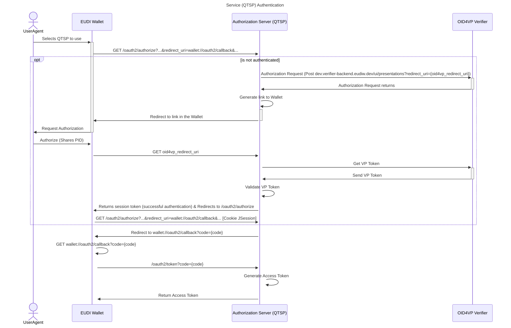

# eudi-srv-web-walletdriven-signer-qtsp-java
rQES R3 QTSP

## Sequence Diagrams

### Wallet Authentication in the QTSP

```mermaid
sequenceDiagram
    title Service (QTSP) Authentication

    actor U as UserAgent
    participant EW as EUDI Wallet
    participant AS as Authorization Server (QTSP)
    participant OIDV as OID4VP Verifier

    U->>+EW: Selects QTSP to use
    EW->>+AS: GET /oauth2/authorize?...&redirect_uri=wallet://oauth2/callback&...

    opt is not authenticated
        AS->>+OIDV: Authorization Request (Post dev.verifier-backend.eudiw.dev/ui/presentations?redirect_uri={oid4vp_redirect_uri})
        OIDV->>-AS: Authorization Request returns
        AS->>+AS: Generate link to Wallet
        AS->>-EW: Redirect to link in the Wallet
        EW->>-U: Request Authorization
        U->>+EW: Authorize (Shares PID)
        EW->>+AS: GET oid4vp_redirect_uri
        AS->>+OIDV: Get VP Token
        OIDV->>-AS: Send VP Token
        AS->>+AS: Validate VP Token
        AS->>+EW: Returns session token (successful authentication) & Redirects to /oauth2/authorize
        EW->>+AS: GET /oauth2/authorize?...&redirect_uri=wallet://oauth2/callback&... [Cookie JSession]
    end

    AS->>+EW: Redirect to wallet://oauth2/callback?code={code}
    EW->>+EW: GET wallet://oauth2/callback?code={code}
    EW->>+AS: /oauth2/token?code={code}
    AS->>+AS: Generate Access Token
    AS->>+EW: Return Access Token
```
