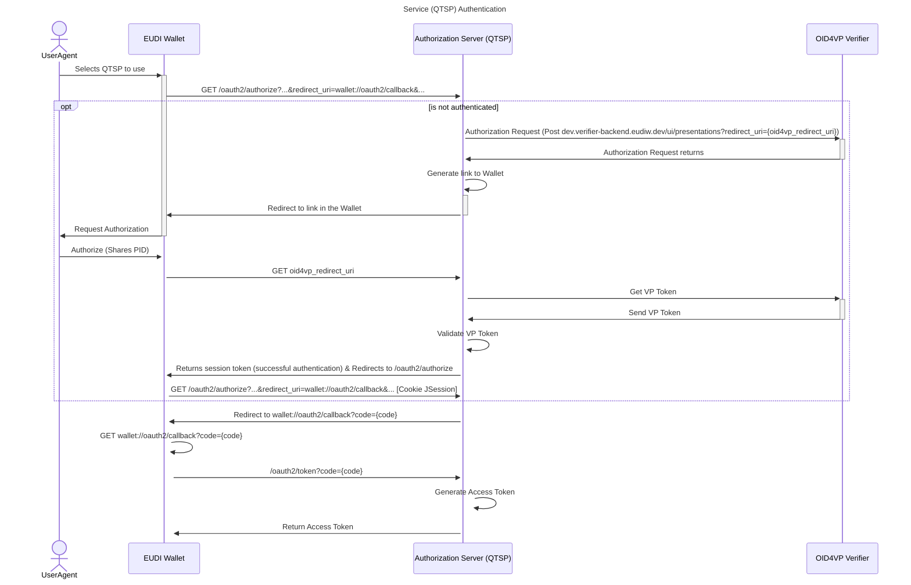
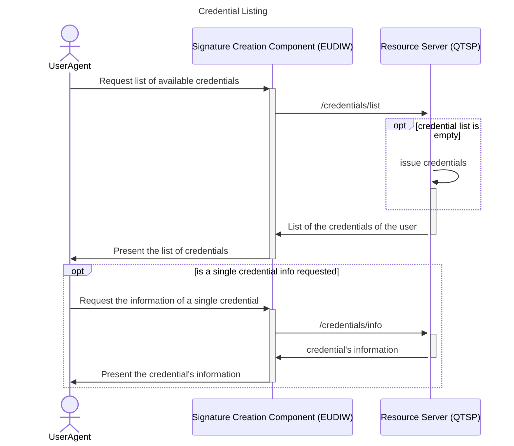
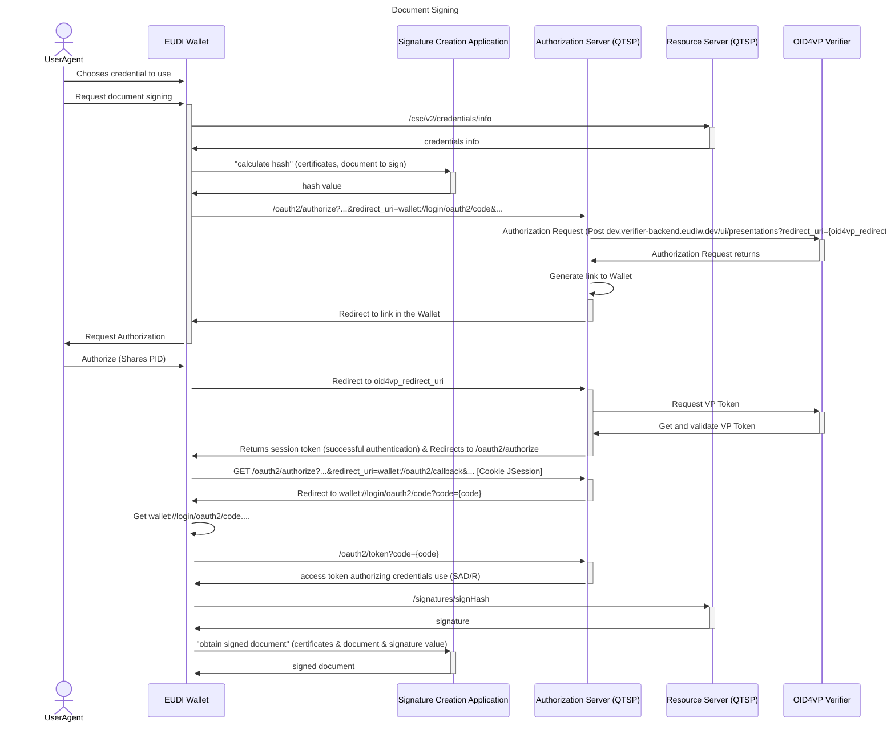
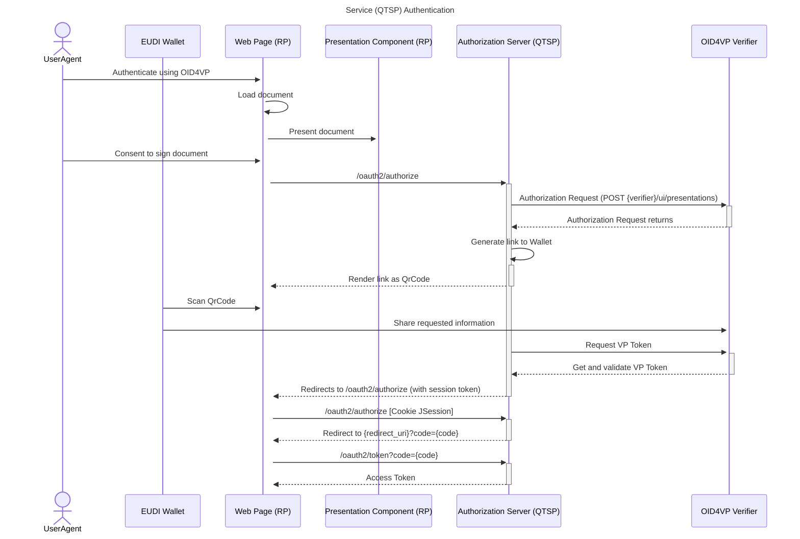
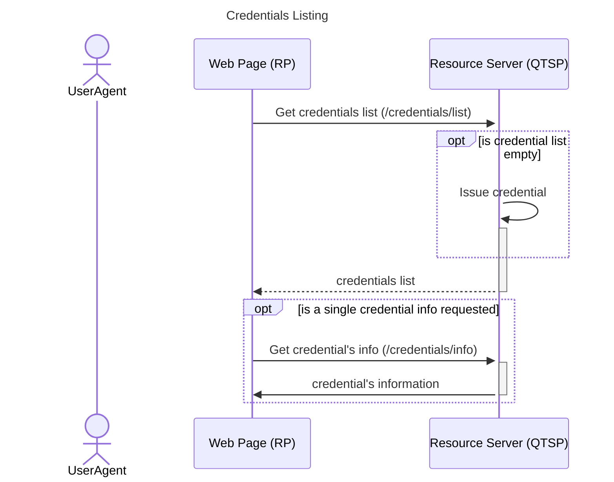
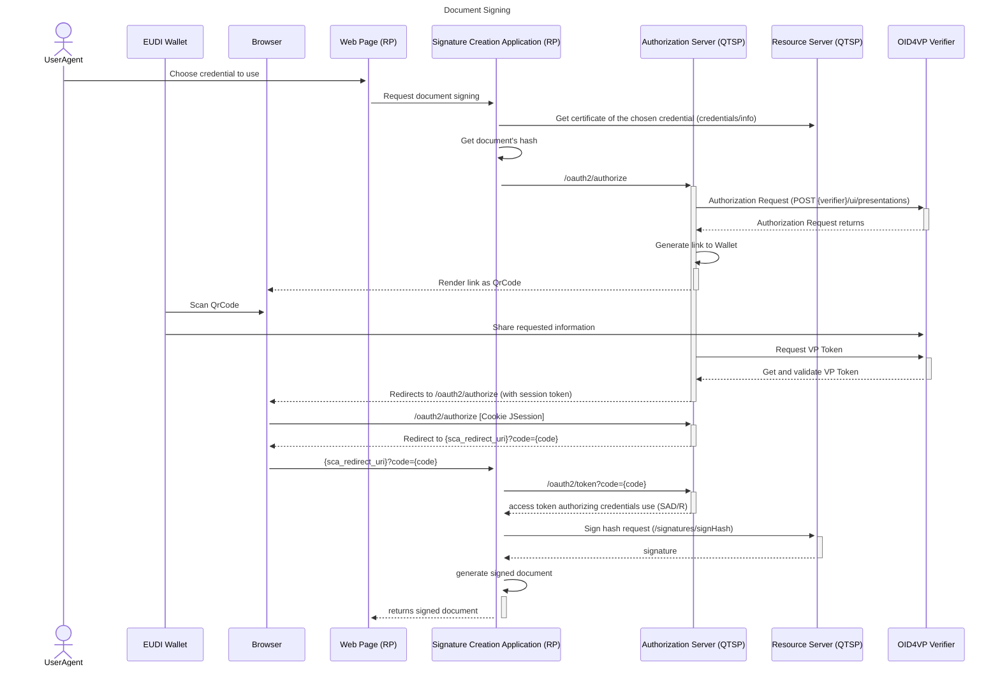

# EUDI Wallet-Driven & RP-Centric signer QTSP

[](https://www.apache.org/licenses/LICENSE-2.0)

:heavy_exclamation_mark: **Important!** Before you proceed, please read
the [EUDI Wallet Reference Implementation project description](https://github.com/eu-digital-identity-wallet/.github/blob/main/profile/reference-implementation.md)

## Table of contents

- [EUDI Wallet-Driven & RP-Centric signer QTSP](#eudi-wallet-driven--rp-centric-signer-qtsp)
  - [Table of contents](#table-of-contents)
  - [Overview](#overview)
  - [Disclaimer](#disclaimer)
  - [Wallet-Driven Sequence Diagrams](#wallet-driven-sequence-diagrams)
    - [Service Authentication](#service-authentication)
    - [Credentials Listing](#credentials-listing)
    - [Credential Authorization](#credential-authorization)
  - [RP-Centric Sequence Diagrams](#rp-centric-sequence-diagrams)
    - [Service Authentication](#service-authentication-1)
    - [Credentials Listing](#credentials-listing-1)
    - [Credential Authorization](#credential-authorization-1)
  - [Endpoints](#endpoints)
  - [Prerequisites](#prerequisites)
    - [Database Setup](#database-setup)
    - [.env File Setup](#env-file-setup)
  - [Local Deployment](#local-deployment)
  - [Docker Deployment](#docker-deployment)
  - [How to contribute](#how-to-contribute)
  - [License](#license)
    - [Third-party component licenses](#third-party-component-licenses)
    - [License details](#license-details)

## Overview

This project provides a RESTful API server that implements a Wallet-Driven and RP-Centric QTSP for the remote Qualified Electronic Signature (rQES) 
in the EUDI Wallet ecosystem. The server follows the CSC API v2.0 specification and supports OpenID4VP-based authentication.

Currently, the server is running at "https://walletcentric.signer.eudiw.dev", but you can [run it locally](#local-deployment) or use the [Docker-based deployment](#docker-deployment) option.

The Wallet Centric rQES Specification can be found [here](docs/rqes-walledriven.md).

## Disclaimer

The released software is an initial development release version:

- The initial development release is an early endeavor reflecting the efforts of a short timeboxed
  period, and by no means can be considered as the final product.
- The initial development release may be changed substantially over time, might introduce new
  features but also may change or remove existing ones, potentially breaking compatibility with your
  existing code.
- The initial development release is limited in functional scope.
- The initial development release may contain errors or design flaws and other problems that could
  cause system or other failures and data loss.
- The initial development release has reduced security, privacy, availability, and reliability
  standards relative to future releases. This could make the software slower, less reliable, or more
  vulnerable to attacks than mature software.
- The initial development release is not yet comprehensively documented.
- Users of the software must perform sufficient engineering and additional testing in order to
  properly evaluate their application and determine whether any of the open-sourced components is
  suitable for use in that application.
- We strongly recommend not putting this version of the software into production use.
- Only the latest version of the software will be supported

## Wallet-Driven Sequence Diagrams

### Service Authentication



### Credentials Listing



### Credential Authorization



## RP-Centric Sequence Diagrams

### Service Authentication



### Credentials Listing



### Credential Authorization



## Endpoints

The endpoints presented below are based on the CSC API v2.0 specifications.

- /oauth2/authorize
- /oauth2/token
- /csc/v2/info
- /csc/v2/credentials/list
- /csc/v2/credentials/info
- /csc/v2/signatures/signHash

## Prerequisites

### Database Setup

To successfully deploy the Authorization Server and Resource Server, a MySQL database must be installed and configured.
This is required for both local and Docker-based deployments.

Follow the steps below to set up the database:

1. **Install and Start MySQL**

   The services require a MySQL database. If you're using Ubuntu or a Debian-based system, you can install and start MySQL server with the following commands:

   ```
   sudo apt install mysql-server -y
   sudo systemctl start mysql.service
   ```

2. **Create Database and User**

   After installing MySQL, open the MySQL shell and execute the following commands to create the database and user:

   ```
   CREATE DATABASE {database_name};
   CREATE USER {database_username}@{ip} IDENTIFIED BY {database_password};
   GRANT ALL PRIVILEGES ON {database_name}.* TO {database_username}@{ip};
   ```

   Replace {ip} with the appropriate IP address or hostname of the database, {database_username} with the username of the user you wish to create, {database_password} with the password of the user and {database_name} with the database to be created. If the services and the database run on the same system, use 'localhost' instead of the IP address:

   ```
   CREATE USER {database_username}@'localhost' IDENTIFIED BY {database_password};
   GRANT ALL PRIVILEGES ON {database_name}.* TO {database_username}@'localhost';
   ```

3. **Configure Environment Variables and Application Settings**

   Add the following variables to your .env file (introduced in the next section):
   ```
   SPRING_DATASOURCE_USERNAME={database_username}
   SPRING_DATASOURCE_PASSWORD={database_password}
   ```   

   Then, update the application.yml files (in the resources folder in the modules authorization_server and resource_server) or the set the required variables in the .env file to point to the database:
   ```
   datasource:
      username: ${SPRING_DATASOURCE_USERNAME}
      password: ${SPRING_DATASOURCE_PASSWORD}
      url: jdbc:mysql://{SPRING_DATASOURCE_DB_URL}/{SPRING_DATASOURCE_DB_NAME}?allowPublicKeyRetrieval=true&useSSL=false&serverTimezone=UTC&useLegacyDatetimeCode=false
      driver-class-name: com.mysql.cj.jdbc.Driver
   ```

   If deploying via Docker, update the value of the variable '{SPRING_DATASOURCE_SERVER}' to 'host.docker.internal:3306/' as the example:
   ```
   datasource:
       url: jdbc:mysql://host.docker.internal:3306/{database_name}?allowPublicKeyRetrieval=true&useSSL=false&serverTimezone=UTC&useLegacyDatetimeCode=false
   ```

   Note: Use host.docker.internal if the MySQL server is running on the host machine and the services are containerized.

4. **Create tables in the database**

   Spring Authorization Server requires specific database schemas for OAuth2.0 support. You can initialize these using the official schema files:

    - https://github.com/spring-projects/spring-authorization-server/blob/main/oauth2-authorization-server/src/main/resources/org/springframework/security/oauth2/server/authorization/client/oauth2-registered-client-schema.sql
    - https://github.com/spring-projects/spring-authorization-server/blob/main/oauth2-authorization-server/src/main/resources/org/springframework/security/oauth2/server/authorization/oauth2-authorization-schema.sql
    - https://github.com/spring-projects/spring-authorization-server/blob/main/oauth2-authorization-server/src/main/resources/org/springframework/security/oauth2/server/authorization/oauth2-authorization-consent-schema.sql

5. **Optional: Add Login Form User**

   During development, it was determined that adding a login form could be important, primarily for integration tests used by other services.
   To add a test user:
    1. Open the tools/add_login_form_user.sql file.
    2. Replace placeholder values with your desired user data.
    3. Execute the script:
       ```shell
       mysql < tools/add_login_form_user.sql
       ```

### .env File Setup

To deploy the Authorization Server and Resource Server, you must create a .env file containing all required environment variables.
This file centralizes configuration details for database access, encryption, and integration with EJBCA and HSM components.
Create a .env file in the root of your project and define the following variables:

   ```
   # --- Spring Configuration ---
   SPRING_PROFILES_ACTIVE=docker
   SPRING_DATASOURCE_USERNAME={database_username}
   SPRING_DATASOURCE_PASSWORD={database_password}
   SPRING_DATASOURCE_DB_NAME={database_name}
   SPRING_DATASOURCE_DB_URL={database_url} # Example: host.docker.internal:3306 or localhost:3306
   
   SYMMETRIC_SECRET_KEY=      # a BASE64-encoded value of an AES secret key for token encryption
   
   # --- Secret Key Encryption ---
   DB_ENCRYPTION_PASSPHRASE=  # Passphrase for encrypting secret keys stored in the database
   DB_ENCRYPTION_SALT=        # Base64-encoded salt used with the passphrase to derive the encryption key
   
   # --- EJBCA Configuration ---
   EJBCA_HOST=                # EJBCA service hostname or IP
   EJBCA_CLIENT_P12_FILEPATH= # Path to the client .pfx/.p12 certificate file
   EJBCA_CLIENT_P12_PASSWORD= # Password for the P12 file
   EJBCA_MANAGEMENT_CA=       # Path to the ManagementCA file
   EJBCA_CERTIFICATE_PROFILE_NAME= # Name of the certificate profile in EJBCA
   EJBCA_END_ENTITY_PROFILE_NAME=  # Name of the end entity profile in EJBCA
   EJBCA_USERNAME=            # EJBCA API username
   EJBCA_PASSWORD=            # EJBCA API password
   
   # --- HSM / PKCS#11 Configuration ---
   JACKNJI11_PKCS11_LIB_PATH= # Path to your PKCS#11 .so library
   JACKNJI11_TEST_INITSLOT=   # Initial HSM slot identifier
   JACKNJI11_TEST_TESTSLOT=   # Secondary HSM slot identifier
   JACKNJI11_TEST_USER_PIN=   # HSM user PIN
   JACKNJI11_TEST_SO_PIN=     # HSM security officer PIN
   
   # Resource Server Configuration
   AUTHORIZATION_SERVER_ISSUER_URI=http://localhost:8084
   AUTHORIZATION_SERVER_JWT_SET_URI=http://localhost:8084

   # Authorization Server Configuration
   SERVICE_URL_OAUTH2_ISSUER= # Example: http://localhost:8084 or http://host.docker.internal:8084
   SERVICE_URL=http://localhost:8084
   ```
Notes:
* Replace the placeholder values with actual values required for your environment.
* The SYMMETRIC_SECRET_KEY and DB_ENCRYPTION_SALT must be Base64-encoded.
* Additional explanation for specific variables will be provided during the setup steps for the modules  *Common Tools*, *Authorization Server* and *Resource Server*.

## Local Deployment

### Requirements

- Java 17
- Apache Maven 3.6.3
- MySQL

### Common Tools Configuration

The Common Tools module requires a symmetric AES key to encode certain values in the JWT Access Token.
This key must be provided via an environment variable and referenced in the configuration file *application-crypto.yml*.
Ensure the following line is present in the mentioned file:
```
symmetric-secret-key: ${SYMMETRIC_SECRET_KEY} # a BASE64-encoded value of an AES secret key
```

The *SYMMETRIC_SECRET_KEY* must be set as an environment variable and should be a Base64-encoded representation of a valid AES key.

Note: Be sure to add the value of the AES key in the .env file to the variable *SYMMETRIC_SECRET_KEY*, as described in [Set up .env file](#set-up-env-file).

Additionally, if you choose to define the SYMMETRIC_SECRET_KEY in a .env file,
be sure to add the following lines to the *application-crypto.yml*:
```
spring:
  config:
    import: file:.env[.properties]
```

### Authorization Server (AS) Configuration

1. **Configure OAuth2.0 Clients**

   It is required to create an **application-secret.yml** file.
   This file allows to configure one or more OAuth2.0 clients of the Authorization Server and must follow the structure below:

   ```
   authorizationserver:
     client:
        {client-id}:
           client-id: "{client-id}"
           client-secret: "{noop}{client-secret}"
           client-authentication-methods:
              - "client_secret_basic"
           authorization-grant-types:
              - "authorization_code"
           redirect-uris:
              - "{redirect-uris}"
           scopes:
              - "service"
              - "credential"
           authentication-flow: {authentication-flow}

        {client-id}:
           client-id: "{client-id}"
           client-secret: "{noop}{client-secret}"
           client-authentication-methods:
              - "client_secret_basic"
           authorization-grant-types:
              - "authorization_code"
           redirect-uris:
              - "{redirect-uris}"
           scopes:
              - "service"
              - "credential"
           authentication-flow: {authentication-flow}
   ```

   > **Note:**
   > The **authentication-flow** value must be one of the supported formats defined in the AuthenticationFlowEnum:
   > - "login-form"
   > - "same-device-flow"
   > - "cross-device-flow"

2. **Set parameters value for authentication using OpenId4VP**

   This application requires users to authenticate and authorize the signature of documents with Certificates they own through their EUDI Wallet.
   To enable this feature (authentication using PID), communication with a backend Verifier is necessary. Define the address and URL of the Verifier by adding the configuration in **application.yml** located in the folder **authorization_server/src/main/resources**:

   ```
   verifier:
      address:
      presentation-url:
      validation-url:
      client_id:
   ```

   By default, this configuration is set to a backend server based on the code from the GitHub 'eu-digital-identity-wallet/eudi-srv-web-verifier-endpoint-23220-4-kt'. Therefore, the default configuration is:

   ```
   verifier:
      address: verifier-backend.eudiw.dev
      presentation-url: https://verifier-backend.eudiw.dev/ui/presentations
      validation-url: https://verifier-backend.eudiw.dev/utilities/validations/msoMdoc/deviceResponse
      client_id: x509_san_dns:verifier-backend.eudiw.dev
   ```

3. **Update the application.yml**

   In the **application.yml**, you can configure a different port for the Authorization Server, which runs on the port 8084 by default.
   To change the port, edit the lines:

   ```
   server:
      port: 8084
   ```

   Additionally, you must update the **service-url-config** configuration to reflect the URL of the Authorization Server.

   ```
   service-url-config:
      oauth2-issuer-url: ${SERVICE_URL_OAUTH2_ISSUER}
      service-url: ${SERVICE_URL}
   ```

   To use the .env file in Spring Boot, you will need to add the following lines to the *application.yml* of the module authorization_server and resource_server and to the *application-crypto.yml* of the module common_tools:
   ```
   spring:
      config:
         import: file:.env[.properties]
   ```

4. **Add the issuers certificate**

   It is required to add to the folder **certificate_of_issuers** the certificates of the issuers of VP Tokens that can be trusted.
   Only the VP Tokens with certificates issued by the certificates in that folder will be accepted.

### Resource Server (RS) Configuration

1. **Set up the Secret Key Encryption Parameters**

   The Resource Server module requires two environment variables (a passphrase and salt value) to encrypt the HSM secret key, 
   which in turn is used to encrypt the signature key.
   These values must be provided as environment variables and referenced in the *application.yml* configuration file. 
   Ensure the following line is present in the mentioned file:
   ```
   auth:
      dbEncryptionPassphrase: ${DB_ENCRYPTION_PASSPHRASE}
      dbEncryptionSalt: ${DB_ENCRYPTION_SALT}
   ```
   Note: Be sure to add the values in the .env file to the variables *DB_ENCRYPTION_PASSPHRASE* and *DB_ENCRYPTION_SALT*, as described in [Set up .env file](#set-up-env-file).
   
2. **Set up the EJBCA Configuration**
   The current implementation makes HTTP requests to an EJBCA server, which serves as a Certificate Authority (CA) for issuing new certificates when a user requests it.
   These HTTP requests are executed using configurations specified in the file **application.yml**, located at **resource_server/src/main/resources**. This file supports configurations for different countries.

   ```
   ejbca:
      cahost: ${EJBCA_HOST}
      clientP12ArchiveFilepath: ${EJBCA_CLIENT_P12_FILEPATH}
      clientP12ArchivePassword: ${EJBCA_CLIENT_P12_PASSWORD}
      managementCA: ${EJBCA_MANAGEMENT_CA}
      endpoint: /certificate/pkcs10enroll
      certificateProfileName: ${EJBCA_CERTIFICATE_PROFILE_NAME}
      endEntityProfileName: ${EJBCA_END_ENTITY_PROFILE_NAME}
      username: ${EJBCA_USERNAME}
      password: ${EJBCA_PASSWORD}
   ```

   You need to set up the environment variables *EJBCA_HOST*, *EJBCA_CLIENT_P12_FILEPATH*, *EJBCA_CLIENT_P12_PASSWORD*, 
   *EJBCA_MANAGEMENT_CA*, *EJBCA_CERTIFICATE_PROFILE_NAME*, *EJBCA_END_ENTITY_PROFILE_NAME*, *EJBCA_USERNAME* and 
   *EJBCA_PASSWORD* in the .env file, as described in [Set up .env file](#set-up-env-file).

3. **Configure the HSM Module**

   The current implementation uses a Hardware Secure Module to create and use the signature keys. The library jacknji11 in https://github.com/joelhockey/jacknji11 allows to make this requests to an HSM distribution. To use this library it is required to define the environmental variables:

   ```
   JACKNJI11_PKCS11_LIB_PATH=  # Path to your PKCS#11 .so library
   JACKNJI11_TEST_TESTSLOT=    # Initial HSM slot identifier
   JACKNJI11_TEST_INITSLOT=    # Secondary HSM slot identifier
   JACKNJI11_TEST_SO_PIN=      # HSM security officer PIN
   JACKNJI11_TEST_USER_PIN=    # HSM user PIN
   ```

   This version of the program was tested using the HSM distribution Utimaco vHSM.

   Define the same values in the .env file, as defined in [Set up .env file](#set-up-env-file).

4. **Update the application.yml**

   In the **application.yml**, it is required to update the value of the configuration to the url of the Authorization Server.

   ```
   spring:
      security:
         oauth2:
            resourceserver:
               jwt:
                  jwk-set-uri: ${AUTHORIZATION_SERVER_JWT_SET_URI}/oauth2/jwks
                  issuer-uri: ${AUTHORIZATION_SERVER_ISSUER_URI}
   ```

   To use the .env file in Spring Boot, you will need to add the following lines to the *application.yml* of the module authorization_server and resource_server and to the *application-crypto.yml* of the module common_tools:
   ```
   spring:
      config:
         import: file:.env[.properties]
   ```

### Execution

After configuring the previously mentioned settings, navigate to the **tools** directory and run the scripts.
It is important to run this scripts in the order presented:

1. **Run the Authorization Server**

   ```
   ./deploy_as.sh
   ```

2. **Run the Resource Server**
   ```
   ./deploy_rs.sh
   ```

## Docker Deployment

You can also deploy the Wallet-Driven & RP-Centric signer QTSP using Docker, either by:

- Pulling the GitHub package image
- Building the image locally

Note: Don't forget to follow the [Prerequisites](#Prerequisites) and configure the database and the .env file.
For more details on environment variables, refer to the Local Deployment sections of each module.

### Requirements

- Docker
- Docker Compose

### Configure docker-compose.yml

You may need to configure a folder with an *application-secret.yml*, presented in the topic *Configure OAuth2.0 Clients* in the section [Authorization Server (AS) Configuration](#authorization-server-as-configuration), as a volume as follows:

```
volumes:
- ./config_files/:/config/
command: ["--spring.config.additional-location=file:/config/application-secret.yml"]
```

In the previous example the file *application-secret.yml* was defined in a folder called *config_files*.

Additionally, we may need to define a volumes for the HSM and EJBCA configuration. 

```
volumes:
   - {PATH_TO_HSM_CONFIG_FILES}:/opt/app/config/hsm/
   - {PATH_TO_EJBCA_CONFIG_FILES}:/opt/app/config/ejbca/
```

Replace {PATH_TO_HSM_CONFIG_FILES} and {PATH_TO_EJBCA_CONFIG_FILES} with the actual paths to your configuration files on the host machine.

If you wish to use the pre-built image available on GitHub instead of building the image locally, modify the docker-compose.yml by replacing the build section with an image declaration like so:

```
services:
  authorization_server:
    image: ghcr.io/eu-digital-identity-wallet/eudi-srv-web-walletdriven-rpcentric-signer-qtsp-java-authorization-server:latest
    container_name: authorizationserver
    ...
  resource_server:
    image: ghcr.io/eu-digital-identity-wallet/eudi-srv-web-walletdriven-rpcentric-signer-qtsp-java-resource-server:latest
    container_name: resourceserver  
    ...
```

**Optional**: To avoid port conflicts, change the exposed port:

```
ports:
    - "8086:8086" # Change first 8086 if the port is already used
```

### Build and Run with Docker

From the project root, run:
`docker compose up --build`

## How to contribute

We welcome contributions to this project. To ensure that the process is smooth for everyone
involved, follow the guidelines found in [CONTRIBUTING.md](CONTRIBUTING.md).

## License

### Third-party component licenses

See [licenses.md](licenses.md) for details.

### License details

Copyright (c) 2023 European Commission

Licensed under the Apache License, Version 2.0 (the "License");
you may not use this file except in compliance with the License.
You may obtain a copy of the License at

    http://www.apache.org/licenses/LICENSE-2.0

Unless required by applicable law or agreed to in writing, software
distributed under the License is distributed on an "AS IS" BASIS,
WITHOUT WARRANTIES OR CONDITIONS OF ANY KIND, either express or implied.
See the License for the specific language governing permissions and
limitations under the License.
