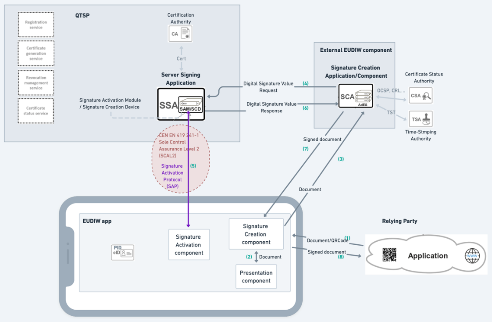
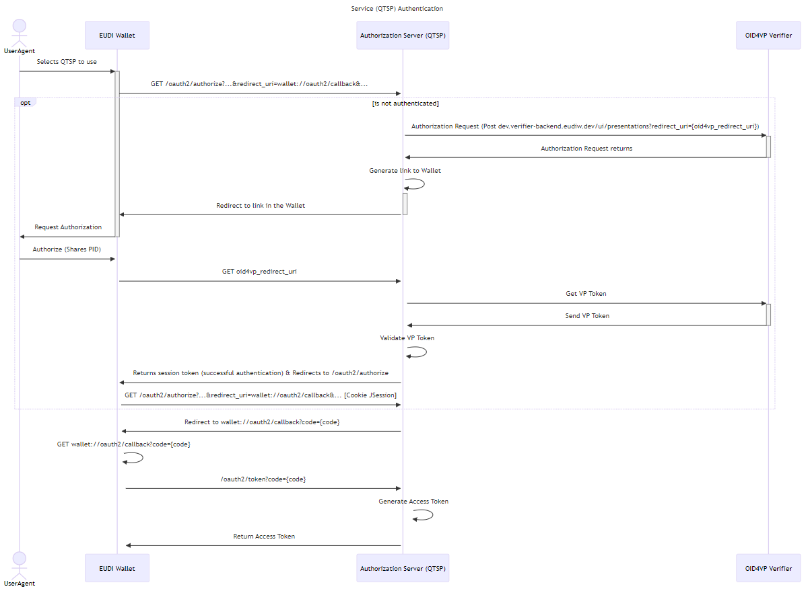
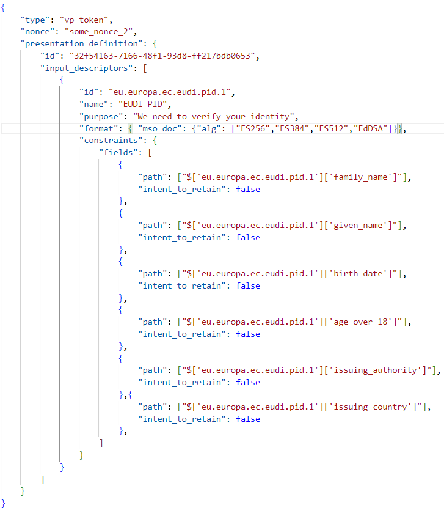
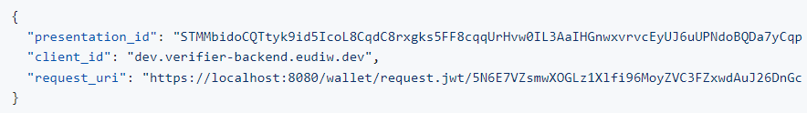
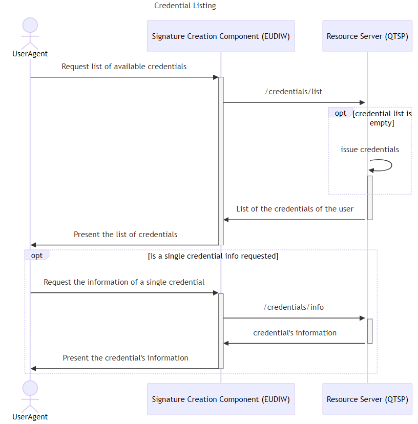
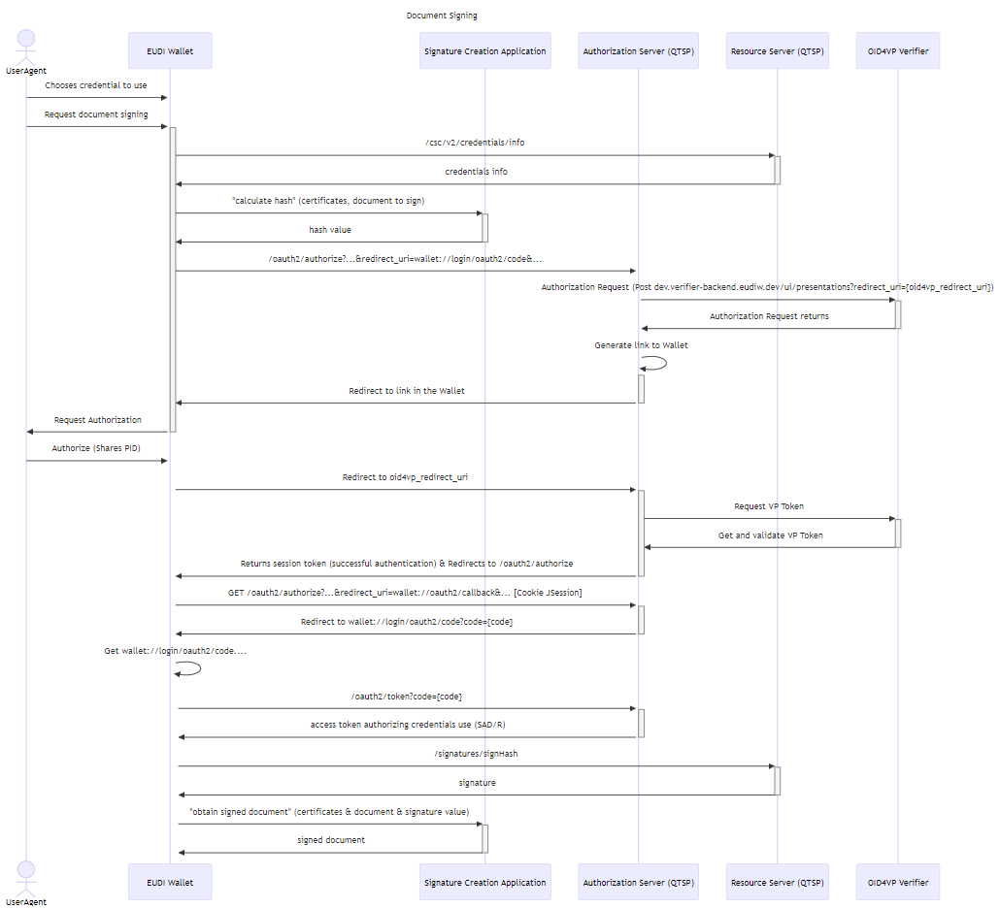
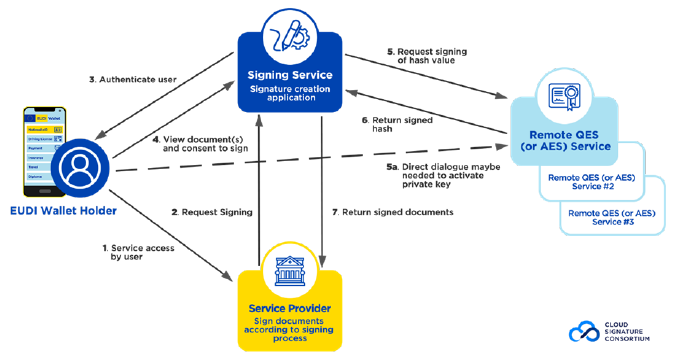

# Wallet Centric rQES Specification

> This document focuses mainly on the interaction between the EUDIW (and its external component, Signature Creation Application) and the QTSP that manages the Server Signing Application.

## Table of contents

- [Wallet Centric rQES Specification](#wallet-centric-rqes-specification)
  - [Table of contents](#table-of-contents)
  - [1. Wallet Centric rQES Architecture](#1-wallet-centric-rqes-architecture)
  - [2. Wallet Components and Corresponding Functionality](#2-wallet-components-and-corresponding-functionality)
  - [3. Wallet centric Signature flow](#3-wallet-centric-signature-flow)
    - [3.1 Service (QTSP) Authentication](#31-service-qtsp-authentication)
      - [3.1.1 OpenId4VP Interactions](#311-openid4vp-interactions)
        - [3.1.1. Example of the Authorization Request (Authorization Server to OID4VP Verifier)](#311-example-of-the-authorization-request-authorization-server-to-oid4vp-verifier)
        - [3.1.1. Authorization Request returns:](#311-authorization-request-returns)
        - [3.1.1. Additional Interactions](#311-additional-interactions)
      - [3.1.2 oauth2/authorize](#312-oauth2authorize)
      - [3.1.2.Response (output of the /oauth2/authorize)](#312response-output-of-the-oauth2authorize)
    - [3.1.3 oauth2/token](#313-oauth2token)
  - [3.2 Credential Listing](#32-credential-listing)
    - [3.2.1 /credentials/list](#321-credentialslist)
    - [3.2.2 /credentials/info](#322-credentialsinfo)
  - [3.3 Document Signing](#33-document-signing)
    - [3.3.1 /oauth2/authorize](#331-oauth2authorize)
    - [3.3.2 /signatures/calculate\_hash](#332-signaturescalculate_hash)
      - [3.3.2.1 Request:](#3321-request)
      - [3.3.2.2 Response:](#3322-response)
      - [3.3.2.3 Documents JSON Array:](#3323-documents-json-array)
    - [3.3.3 /oauth2/token](#333-oauth2token)
    - 
    - [3.3.4 /signatures/obtain\_signed\_doc](#334-signaturesobtain_signed_doc)
      - [3.3.4.1 Request:](#3341-request)
      - [3.3.4.2 Response:](#3342-response)
    - [3.3.5 /signatures/signHash](#335-signaturessignhash)
- [Annex 1](#annex-1)

## 1. Wallet Centric rQES Architecture

The following figure presents the current conceptual architecture and
the components that interact in this environment.

<figure>

<figcaption>
Figure 1 - Wallet centric rQES conceptual
architecture
</figcaption>
</figure>

## 2. Wallet Components and Corresponding Functionality

+ **Signature Activation Component (SAC)**

    The Signature Activation Component (SAC) receives and responds to
(extended[1]) “OID4VP” protocol requests from the Signature Activation Module (SAM). The SAC will
prompt the user to share their PID data (enabling the SAM to
authenticate the user) and will also request the user’s consent for the
SAM to access their private key to sign a hash. The (extended) “OID4VP”
request will include details about what the SAM is requesting to sign,
and this information will be displayed to the user before they consent
to allow the SAM to access their private key for signing.

+ **Signature Creation Component (SCC)**

    The Signature Creation Component (SCC) acts as the ‘controller’ for the entire process. It receives the request to sign a document, along with
the document itself, from the Relying Party (RP) Application, calls the
Presentation component to display the document to the user, and allows
the user to decide whether to sign the document and select the
appropriate certificate. The SCC also interacts with the external
Signature Creation Application (SCA) and the QTSP (SSA), listing the
available QTSPs for the user to choose from.

-   **Presentation Component (PC)**

    The Presentation Component (PC) displays the document and associated
information received from the RP Application. After showing the
document, the wallet allows the user to decide whether to sign it or
not.”

## 3. Wallet centric Signature flow

The following wallet centric signature flow is analyzed in this
document:

1.  Service (QTSP) Authentication

2.  Credential Listing

3.  Document Signing

### 3.1 Service (QTSP) Authentication

**Before initiating the credential listing or signing operation, the
Wallet must authenticate itself to the QTSP. In this signature flow, it
is assumed that both the wallet and the external component (SCA) have
been previously registered with the QTSP.**

To initiate user authentication with the QTSP (Service Authentication
process), the SIC (Signature Activation Component) will send a request
to the QTSP Authorization Server. The authentication is carried out
using the OAuth2 protocol, complemented by the OpenId4VP protocol:

1.  The user selects the QTSP they want to use to sign the document. We
    assume that at least one QTSP (the one offering free signatures)
    will be configured in the Wallet.

2.  The EUDIW sends an HTTP request to the `/oauth2/authorize` endpoint of
    the Authorization Server (QTSP) to initiate the user authentication
    process.

3.  The QTSP makes a request to the OpenId4VP Verifier to start the
    Authorization Request.

4.  The QTSP generates a deep link to the Wallet .

5.  The EUDIW requests the user to share the necessary PID information.

6.  After sharing, the wallet will be redirected to the redirect\_url
    (provided in step 4) in the QTSP.

7.  The QTSP interacts with the Verifier to obtain the VP Token.

8.  After validating the VP Token, the QTSP marks the current Session ID
    Cookie as authenticated, and redirects the client back to the
    `/oauth2/authorize` endpoint. If all parameters are valid, a code is
    generated, and the client app is redirected to the "redirect\_url"
    specified in the request.

9.  With that code value, an access token can be requested at the
    `/oauth2/token` endpoint. This access token will grant access to the
    QTSP Resource Server.

#### 3.1.1 OpenId4VP Interactions

##### 3.1.1. Example of the Authorization Request (Authorization Server to OID4VP Verifier)

##### 3.1.1. Authorization Request returns:

##### 3.1.1. Additional Interactions

With the values from the request and from the response, we will generate
two links:

**1.
eudi-openid4vp://dev.verifier-backend.eudiw.dev?client\_id={client\_id}&request\_uri={request\_uri}**

This deep link is generated using the **client\_id** and the
**request\_uri** from the Authorization Request’s returned value. It
should then be sent to the Wallet to redirect the user to a page where
they can select which data to share.

**2. https://dev.verifier-backend.eudiw.dev/ui/presentations/{presentation\_id}?nonce={nonce}**

Using this link, the QTSP can obtain the VP Token from the Verifier once
the user has authorized the sharing of the requested data.

#### 3.1.2 oauth2/authorize

<table>
<colgroup>
<col style="width: 24%" />
<col style="width: 12%" />
<col style="width: 10%" />
<col style="width: 52%" />
</colgroup>
<thead>
<tr>
<th style="text-align: left;"><strong>Name</strong></th>
<th style="text-align: left;"><strong>Presence</strong></th>
<th style="text-align: left;"><strong>Type</strong></th>
<th style="text-align: left;"><strong>Description</strong></th>
</tr>
</thead>
<tbody>
<tr>
<td style="text-align: left;">response_type</td>
<td>REQUIRED</td>
<td style="text-align: left;">String</td>
<td style="text-align: left;">The value SHALL be “code”.</td>
</tr>
<tr>
<td style="text-align: left;">client_id</td>
<td style="text-align: left;">REQUIRED</td>
<td style="text-align: left;">String</td>
<td style="text-align: left;">The client identifier as defined in oauth2
[RFC 6749].</td>
</tr>
<tr>
<td style="text-align: left;">redirect_uri</td>
<td style="text-align: left;">
REQUIRED

Conditional
</td>
<td style="text-align: left;">String</td>
<td style="text-align: left;">
The URL where the user will be
redirected after the authorization process has completed.

If omitted, the remote service will use the default redirect URI
pre-registered by the signature application.
</td>
</tr>
<tr>
<td style="text-align: left;">scope</td>
<td>OPTIONAL</td>
<td style="text-align: left;">String</td>
<td style="text-align: left;">For Service Authentication flow SHALL be
“service”: it SHALL be used to obtain an authorization code suitable for
service authorization.</td>
</tr>
<tr>
<td style="text-align: left;">code_challenge</td>
<td style="text-align: left;">REQUIRED</td>
<td style="text-align: left;">String</td>
<td style="text-align: left;">Cryptographic nonce binding the
transaction to a certain user agent, used to detect code replay and CSRF
attacks.</td>
</tr>
<tr>
<td style="text-align: left;">code_challenge_method</td>
<td>OPTIONAL</td>
<td style="text-align: left;">String</td>
<td style="text-align: left;">Code verifier transformation method. Used
to obtain the “code_challenge” from the “code_verifier”. Defaults to
“plain”, but the recommended value is “S256”.</td>
</tr>
<tr>
<td style="text-align: left;">state</td>
<td>OPTIONAL</td>
<td style="text-align: left;">String</td>
<td style="text-align: left;">A value used by the client to maintain
state between the request and callback, as defined in oauth2 [RFC
6749].</td>
</tr>
<tr>
<td style="text-align: left;">request_uri</td>
<td style="text-align: left;">
REQUIRED

Conditional
</td>
<td style="text-align: left;">String</td>
<td style="text-align: left;">URI pointing to a pushed authorization
request previously uploaded by the client. <strong>(Note: this mechanism
is not currently supported)</strong></td>
</tr>
<tr>
<td style="text-align: left;">lang</td>
<td>OPTIONAL</td>
<td style="text-align: left;">String</td>
<td style="text-align: left;">Request a preferred language according to
RFC 5646. If specified, the authorization server SHOULD render the
authorization web page in this language, if supported.</td>
</tr>
<tr>
<td style="text-align: left;">description</td>
<td>OPTIONAL</td>
<td style="text-align: left;">String</td>
<td style="text-align: left;">A free form description of the
authorization transaction in the <em>lang</em> language.</td>
</tr>
<tr>
<td style="text-align: left;">account_token</td>
<td>OPTIONAL</td>
<td style="text-align: left;">String</td>
<td style="text-align: left;">An account_token as defined in [CSC-API]
section 8.4.1. <strong>(Note: this parameter is not currently
supported)</strong></td>
</tr>
<tr>
<td style="text-align: left;">clientData</td>
<td>OPTIONAL</td>
<td style="text-align: left;">String</td>
<td style="text-align: left;">Arbitrary data from the signature
application.</td>
</tr>
</tbody>
</table>

#### 3.1.2.Response (output of the /oauth2/authorize)

<table>
<colgroup>
<col style="width: 24%" />
<col style="width: 12%" />
<col style="width: 10%" />
<col style="width: 52%" />
</colgroup>
<thead>
<tr>
<th style="text-align: center;"><strong>Name</strong></th>
<th style="text-align: center;"><strong>Presence</strong></th>
<th style="text-align: center;"><strong>Type</strong></th>
<th style="text-align: center;"><strong>Description</strong></th>
</tr>
</thead>
<tbody>
<tr>
<td>code</td>
<td>REQUIRED</td>
<td>String</td>
<td>The authorization code generated by the authorization server. It
SHALL be bound to the client identifier and the redirection URI.</td>
</tr>
<tr>
<td>state</td>
<td style="text-align: left;">
REQUIRED

Conditional
</td>
<td>String</td>
<td>Contains the arbitrary data from the signature application that was
specified in the state attribute of the input request.</td>
</tr>
<tr>
<td>error</td>
<td>
REQUIRED

Conditional
</td>
<td>String</td>
<td>See [CSC-API] section 8.4.2.</td>
</tr>
<tr>
<td>error_description</td>
<td>OPTIONAL</td>
<td>String</td>
<td>See [CSC-API] section 8.4.2.</td>
</tr>
<tr>
<td>error_uri</td>
<td>OPTIONAL</td>
<td>String</td>
<td>See [CSC-API] section 8.4.2.</td>
</tr>
</tbody>
</table>

### 3.1.3 oauth2/token

Requirement: In the Authentication header, there should be the value of
the Basic Auth obtained from the oauth2’s client\_id and client\_secret

<table>
<colgroup>
<col style="width: 24%" />
<col style="width: 12%" />
<col style="width: 10%" />
<col style="width: 52%" />
</colgroup>
<thead>
<tr>
<th style="text-align: center;"><strong>Name</strong></th>
<th style="text-align: center;"><strong>Presence</strong></th>
<th style="text-align: center;"><strong>Type</strong></th>
<th style="text-align: center;"><strong>Description</strong></th>
</tr>
</thead>
<tbody>
<tr>
<td>grant_type</td>
<td>REQUIRED</td>
<td>String</td>
<td>
The grant type, which depends on the type of OAuth 2.0 flow:

<ul>
<li>
“authorization_code” SHALL be used in case of Authorization Code
Grant
</li>
</ul></td>
</tr>
<tr>
<td>code</td>
<td>REQUIRED</td>
<td>String</td>
<td>The authorization code returned by the authorization server. It
SHALL be bound to the client identifier and the redirection URI.</td>
</tr>
<tr>
<td>client_id</td>
<td>REQUIRED</td>
<td>String</td>
<td>A client_id that was send before by Signature Interaction Component
(SIC) during request (see Section 3.4.3.3 of CSC).</td>
</tr>
<tr>
<td>code_verifier</td>
<td>REQUIRED</td>
<td>String</td>
<td>The String value (nonce) that was used to generate the
code_challenge from the /oauth2/authorize. See PKCE resources.</td>
</tr>
<tr>
<td>redirect_uri</td>
<td>REQUIRED</td>
<td>String</td>
<td>An URL that was send before by Signature Interaction Component (SIC)
and where the user was redirected after the authorization process
completed. It is used to validate that it matches the original value
previously passed to the authorization server.</td>
</tr>
</tbody>
</table>

## 3.2 Credential Listing

**For this flow, it is assumed that the Wallet has already executed the
service authentication (see section [3.1](#31-sevice-qtsp-authentication)) on the QTSP that will be
used.**

After the user has agreed to sign the document and selected which QTSP
will be used, the Wallet shall display the available credentials from
the chosen QTSP. To achieve this, the Wallet shall request the list of
credentials (including certificates and additional information) from the
QTSP via the `/credentials/list` endpoint.

Additionally, the EUDI Wallet can show detailed information about each
credential by setting credentialInfo to true in the /credentials/list
request, or by making a request to the `/credentials/info` endpoint if
available.

**\[Note: The HTTP request has the authentication token in the
header\]**

### 3.2.1 /credentials/list

<table>
<colgroup>
<col style="width: 24%" />
<col style="width: 12%" />
<col style="width: 10%" />
<col style="width: 52%" />
</colgroup>
<thead>
<tr>
<th style="text-align: center;"><strong>Parameter</strong></th>
<th style="text-align: center;"><strong>Presence</strong></th>
<th style="text-align: center;"><strong>Value</strong></th>
<th style="text-align: center;"><strong>Description</strong></th>
</tr>
</thead>
<tbody>
<tr>
<td>userID</td>
<td>REQUIRED Conditional</td>
<td>String</td>
<td>
This parameter SHALL NOT be present as the service authorization
will be user-specific. <strong>The userID is already implicit in the
service access token passed in the Authorization header.</strong>

It SHALL NOT be allowed to use this parameter to obtain the list of
credentials associated to a different user. The remote service SHALL
return an error in such case.
</td>
</tr>
<tr>
<td>credentialInfo</td>
<td>OPTIONAL</td>
<td>Boolean</td>
<td>Request to return the main information included in the public key
certificate and the public key certificate itself or the certificate
chain associated to the credentials. The default value is “false”.</td>
</tr>
<tr>
<td>certificates</td>
<td>OPTIONAL Conditional</td>
<td>String | none | single | chain</td>
<td>
Specifies which certificates from the certificate chain SHALL be
returned in certs/certificates:

<ul>
<li>
“none”: No certificate SHALL be returned.
</li>
<li>
“single”: Only the end entity certificate SHALL be
returned.
</li>
<li>
“chain”: The full certificate chain SHALL be returned.
</li>
</ul>

The default value is “single”.

This parameter MAY be specified only if the parameter credentialInfo
is “true”.
</td>
</tr>
<tr>
<td>certInfo</td>
<td>OPTIONAL Conditional</td>
<td>Boolean</td>
<td>
Request to return various parameters containing information from
the end entity certificate(s). This is useful in case the signature
application wants to retrieve some details of the certificate(s) without
having to decode it first. The default value is“false”.

This parameter MAY be specified only if the parameter credentialInfo
is “true”.
</td>
</tr>
<tr>
<td>authInfo</td>
<td>OPTIONAL Conditional</td>
<td>Boolean</td>
<td>Request to return various parameters containing information on the
authorization mechanisms supported by the corresponding credential (auth
group). The default value is “false”. This parameter MAY be specified
only if the parameter credentialInfo is “true”.</td>
</tr>
<tr>
<td>onlyValid</td>
<td>OPTIONAL Conditional</td>
<td>Boolean</td>
<td>
Request to return only credentials usable to create a valid
signature. The default value is “false”, so if the parameter is omitted
then the method will return all credentials available to the owner.

The remote server may not support this parameter.
</td>
</tr>
<tr>
<td>lang</td>
<td>OPTIONAL</td>
<td>String</td>
<td>Request a preferred language of the response to the remote
service.</td>
</tr>
<tr>
<td>clientData</td>
<td>OPTIONAL</td>
<td>String</td>
<td>Arbitrary data from the signature application.</td>
</tr>
</tbody>
</table>

### 3.2.2 /credentials/info

<table>
<colgroup>
<col style="width: 24%" />
<col style="width: 12%" />
<col style="width: 10%" />
<col style="width: 52%" />
</colgroup>
<thead>
<tr>
<th style="text-align: center;"><strong>Parameter</strong></th>
<th style="text-align: center;"><strong>Presence</strong></th>
<th style="text-align: center;"><strong>Value</strong></th>
<th style="text-align: center;"><strong>Description</strong></th>
</tr>
</thead>
<tbody>
<tr>
<td>credentialID</td>
<td>REQUIRED</td>
<td>String</td>
<td>The unique identifier associated to the credential.</td>
</tr>
<tr>
<td>certificates</td>
<td>OPTIONAL</td>
<td>String | none | single | chain</td>
<td>The certificates as defined in the previous table.</td>
</tr>
<tr>
<td>certInfo</td>
<td>OPTIONAL</td>
<td>Boolean</td>
<td>The certInfo as defined in the previous table.</td>
</tr>
<tr>
<td>authInfo</td>
<td>OPTIONAL</td>
<td>Boolean</td>
<td>The authInfo as defined in the previous table</td>
</tr>
<tr>
<td>lang</td>
<td>OPTIONAL</td>
<td>String</td>
<td>Request a preferred language of the response to the remote
service.</td>
</tr>
<tr>
<td>clientData</td>
<td>OPTIONAL</td>
<td>String</td>
<td>Arbitrary data from the signature application.</td>
</tr>
</tbody>
</table>

## 3.3 Document Signing

**For this flow, it is assumed that the Wallet has already completed the
credential listing (see section [3.2](#32-credential-listing)).**

The flow described in this section begins after the document to be
signed has been displayed to the user, the user has approved the signing
of the document, and if the user has selected an existing certificate
for the signature.

The signature process is divided into two main operations: credential
authorization and document signing.

In the credential authorization flow, the Wallet sends the document to
be signed, along with the certificate and the certificate chain of the
credential chosen, and other relevant information required by the
`/signatures/calculate_hash` endpoint in the SCA. The SCA then computes
the hash of the document to be signed. Following this, the Wallet
requests authorization from the QTSP to use the private signing key,
initiating an OAuth2 flow with OpenID for Verifiable Presentations.

Once the Wallet receives the token granting access to the chosen
credential, the document signing process can proceed. The Wallet should
then use the QTSP API to obtain the signature for the hash value.
Finally, a request should be sent to the SCA with the signature value,
the document to be signed, the certificate, and any other required data.

In the future, the extended “OID4VP” request will
include details about what the SAM is requesting to sign and which
credential will be used, with this information displayed to the user
before they consent to allowing the SAM to access their private key for
signing.

**\[Note: All requests include the received token in the HTTP header\]**

### 3.3.1 /oauth2/authorize

<table>
<colgroup>
<col style="width: 24%" />
<col style="width: 12%" />
<col style="width: 10%" />
<col style="width: 52%" />
</colgroup>
<thead>
<tr>
<th style="text-align: center;"><strong>Name</strong></th>
<th style="text-align: center;"><strong>Presence</strong></th>
<th style="text-align: center;"><strong>Type</strong></th>
<th style="text-align: center;"><strong>Description</strong></th>
</tr>
</thead>
<tbody>
<tr>
<td>response_type</td>
<td>REQUIRED</td>
<td>String</td>
<td>The value SHALL be “code”.</td>
</tr>
<tr>
<td>client_id</td>
<td>REQUIRED</td>
<td>String</td>
<td style="text-align: left;">The client identifier as defined in oauth2
[RFC 6749].</td>
</tr>
<tr>
<td>redirect_uri</td>
<td>
REQUIRED

Conditional
</td>
<td>String</td>
<td style="text-align: left;">
The URL where the user will be
redirected after the authorization process has completed.

If omitted, the remote service will use the default redirect URI
pre-registered by the signature application.
</td>
</tr>
<tr>
<td>scope</td>
<td>OPTIONAL</td>
<td>String</td>
<td>For Document Signing flow SHALL be “credential”: it SHALL be used to
obtain an authorization code suitable for credentials
authorization.</td>
</tr>
<tr>
<td>authorization_details</td>
<td>OPTIONAL</td>
<td>JSON object as String</td>
<td>
The details on the access request for credentials. Details
presented on the CSC v2.0.0.2.

If this parameter is used, all values relevant for credential
authorization SHALL be passed in this object. The scope “credential” as
well as any request parameter relevant for credential authorization
SHALL NOT be used in this case.
</td>
</tr>
<tr>
<td>code_challenge</td>
<td>REQUIRED</td>
<td>String</td>
<td style="text-align: left;">Cryptographic nonce binding the
transaction to a certain user agent, used to detect code replay and CSRF
attacks.</td>
</tr>
<tr>
<td>code_challenge_method</td>
<td>OPTIONAL</td>
<td>String</td>
<td style="text-align: left;">Code verifier transformation method. Used
to obtain the “code_challenge” from the “code_verifier”. Defaults to
“plain”, but the recommended value is “S256”.</td>
</tr>
<tr>
<td>state</td>
<td>OPTIONAL</td>
<td>String</td>
<td style="text-align: left;">A value used by the client to maintain
state between the request and callback, as defined in oauth2 [RFC
6749].</td>
</tr>
<tr>
<td>request_uri</td>
<td>
REQUIRED

Conditional
</td>
<td>String</td>
<td>URI pointing to a pushed authorization request previously uploaded
by the client. <strong>(Note: this mechanism is not currently
supported)</strong></td>
</tr>
<tr>
<td>lang</td>
<td>OPTIONAL</td>
<td>String</td>
<td style="text-align: left;">Request a preferred language according to
RFC 5646. If specified, the authorization server SHOULD render the
authorization web page in this language, if supported.</td>
</tr>
<tr>
<td>credentialID</td>
<td>
REQUIRED

Conditional
</td>
<td>String</td>
<td>The identifier associated to the credential to authorize. It SHALL
be used only if the scope of the OAuth 2.0 authorization request is
“credential”.</td>
</tr>
<tr>
<td>signatureQualifier</td>
<td>REQUIRED Conditional</td>
<td>String</td>
<td>This parameter contains the symbolic identifier determining the kind
of signature to be created. It SHALL be used only if the scope is
“credential” and if there is no parameter “credentialID” present.
<strong>(Note: this mechanism is not currently supported)</strong></td>
</tr>
<tr>
<td>numSignatures</td>
<td>REQUIRED Conditional</td>
<td>Number</td>
<td>The number of signatures to authorize.</td>
</tr>
<tr>
<td>hashes</td>
<td>REQUIRED Conditional</td>
<td>String</td>
<td>One or more base64url-encoded hash values to be signed. It SHALL be
used if the scope is “credential” and if the SCAL parameter returned by
credentials/info method for the chosen credential is “2”.</td>
</tr>
<tr>
<td>hashAlgorithmOID</td>
<td>REQUIRED Conditional</td>
<td>String</td>
<td>String containing the OID of the hash algorithm used to generate the
hashes.</td>
</tr>
<tr>
<td>description</td>
<td>OPTIONAL</td>
<td>String</td>
<td style="text-align: left;">A free form description of the
authorization transaction in the <em>lang</em> language.</td>
</tr>
<tr>
<td>account_token</td>
<td>OPTIONAL</td>
<td>String</td>
<td style="text-align: left;">An account_token as defined in [CSC-API]
section 8.4.1. <strong>(Note: this parameter is not currently
supported)</strong></td>
</tr>
<tr>
<td>clientData</td>
<td>OPTIONAL</td>
<td>String</td>
<td style="text-align: left;">Arbitrary data from the signature
application.</td>
</tr>
</tbody>
</table>

 

-   Authorization details (authorization\_details) type “credential” as
    defined in the CSC API v2.0.0.2:

<table>
<colgroup>
<col style="width: 24%" />
<col style="width: 12%" />
<col style="width: 10%" />
<col style="width: 52%" />
</colgroup>
<thead>
<tr>
<th style="text-align: center;"><strong>Name</strong></th>
<th style="text-align: center;"><strong>Presence</strong></th>
<th style="text-align: center;"><strong>Type</strong></th>
<th style="text-align: center;"><strong>Description</strong></th>
</tr>
</thead>
<tbody>
<tr>
<td>type</td>
<td>REQUIRED</td>
<td>String</td>
<td>Authorization details type identifier. It SHALL be set to
“credential”.</td>
</tr>
<tr>
<td>credentialID</td>
<td>REQUIRED</td>
<td>String</td>
<td>The identifier associated to the credential to authorize.</td>
</tr>
<tr>
<td>signatureQualifier</td>
<td>REQUIRED</td>
<td>String</td>
<td>This parameter contains the symbolic identifier determining the kind
of signature to be created. <strong>(Note: this mechanism is not
currently supported)</strong></td>
</tr>
<tr>
<td>documentDigests</td>
<td>REQUIRED</td>
<td>JSON Array</td>
<td>
An array composed of entries for every document to be signed.
Every entry is composed of the following elements:

<ul>
<li>
“hash”: Base64-encoded octet-representation of the hash of the
document
</li>
<li>
“label”: A human-readable description of the respective
document
</li>
</ul></td>
</tr>
<tr>
<td>hashAlgorithmOID</td>
<td>REQUIRED</td>
<td>String</td>
<td>String containing the OID of the hash algorithm used to generate the
hashes listed in documentDigests.</td>
</tr>
</tbody>
</table>

### 3.3.2 /signatures/calculate\_hash

#### 3.3.2.1 Request: 

<table>
<colgroup>
<col style="width: 24%" />
<col style="width: 12%" />
<col style="width: 10%" />
<col style="width: 52%" />
</colgroup>
<thead>
<tr>
<th><strong>Parameter</strong></th>
<th><strong>Presence</strong></th>
<th><strong>Value</strong></th>
<th><strong>Description</strong></th>
</tr>
</thead>
<tbody>
<tr>
<td>documents</td>
<td>REQUIRED</td>
<td>JSON Array</td>
<td>An array containing JSON objects, each of them containing a
base64-encoded document content to be signed and further request
parameter.</td>
</tr>
<tr>
<td>endEntityCertificate</td>
<td>REQUIRED</td>
<td>String</td>
<td></td>
</tr>
<tr>
<td>certificateChain</td>
<td>Optional</td>
<td>List of String</td>
<td>The certificate chain to be used when calculating the hash,
excluding the end-entity certificate. If the list of certificates is not
provided, it will be considered empty.</td>
</tr>
<tr>
<td>hashAlgorithmOID</td>
<td>REQUIRED</td>
<td>String</td>
<td>String containing the OID of the hash algorithm used to generate the
hashes.</td>
</tr>
</tbody>
</table>

#### 3.3.2.2 Response: 

<table>
<colgroup>
<col style="width: 24%" />
<col style="width: 12%" />
<col style="width: 10%" />
<col style="width: 52%" />
</colgroup>
<thead>
<tr>
<th style="text-align: left;"><strong>Parameter</strong></th>
<th><strong>Presence</strong></th>
<th style="text-align: left;"><strong>Value</strong></th>
<th><strong>Description</strong></th>
</tr>
</thead>
<tbody>
<tr>
<td style="text-align: left;">hashes</td>
<td>REQUIRED</td>
<td style="text-align: left;">List of String</td>
<td>One or more Base64 URL-encoded hash values to be signed.</td>
</tr>
<tr>
<td style="text-align: left;">signature_date</td>
<td>REQUIRED</td>
<td style="text-align: left;">long</td>
<td>The date of the signature request, as a long, which should be used
when obtaining a signed document.</td>
</tr>
</tbody>
</table>

#### 3.3.2.3 Documents JSON Array:

<table>
<colgroup>
<col style="width: 23%" />
<col style="width: 12%" />
<col style="width: 10%" />
<col style="width: 52%" />
</colgroup>
<thead>
<tr>
<th><strong>Parameter</strong></th>
<th><strong>Presence</strong></th>
<th><strong>Value</strong></th>
<th><strong>Description</strong></th>
</tr>
</thead>
<tbody>
<tr>
<td>document</td>
<td>REQUIRED</td>
<td>String</td>
<td>Base64-encoded document content to be signed.</td>
</tr>
<tr>
<td>signature_format</td>
<td>REQUIRED</td>
<td>String</td>
<td>
The required signature format:

<ul>
<li>
“C” SHALL be used to request the creation of a CAdES
signature;
</li>
</ul>
<ul>
<li>
“X” SHALL be used to request the creation of a XAdES
signature.
</li>
</ul>
<ul>
<li>
“P” SHALL be used to request the creation of a PAdES
signature.
</li>
</ul>
<ul>
<li>
“J” SHALL be used to request the creation of a JAdES
signature.
</li>
</ul></td>
</tr>
<tr>
<td>conformance_level</td>
<td>REQUIRED</td>
<td>String</td>
<td>The required signature conformance level.</td>
</tr>
<tr>
<td>signed_props</td>
<td>OPTIONAL</td>
<td>Array of attribute</td>
<td>List of signed attributes. The attributes that may be included
depend on the signature format and the signature creation policy.</td>
</tr>
<tr>
<td>signed_envelope_property</td>
<td>REQUIRED</td>
<td>String</td>
<td>The required property concerning the signed envelope.</td>
</tr>
<tr>
<td>container</td>
<td>REQUIRED</td>
<td>String</td>
<td></td>
</tr>
</tbody>
</table>

### 3.3.3 /oauth2/token

<table>
<colgroup>
<col style="width: 23%" />
<col style="width: 12%" />
<col style="width: 10%" />
<col style="width: 52%" />
</colgroup>
<thead>
<tr>
<th style="text-align: center;"><strong>Name</strong></th>
<th style="text-align: center;"><strong>Presence</strong></th>
<th style="text-align: center;"><strong>Type</strong></th>
<th style="text-align: center;"><strong>Description</strong></th>
</tr>
</thead>
<tbody>
<tr>
<td>grant_type</td>
<td>REQUIRED</td>
<td>String</td>
<td>
The grant type, which depends on the type of OAuth 2.0 flow:

<ul>
<li>
“authorization_code”: SHALL be used in case of Authorization Code
Grant
</li>
</ul></td>
</tr>
<tr>
<td>code</td>
<td>REQUIRED</td>
<td>String</td>
<td>The authorization code returned by the authorization server. It
SHALL be bound to the client identifier and the redirection URI.</td>
</tr>
<tr>
<td>client_id</td>
<td>REQUIRED</td>
<td>String</td>
<td>A client_id that was send before by Signature Interaction Component
(SIC) during request (see Section 3.4.3.3 of CSC).</td>
</tr>
<tr>
<td>code_verifier</td>
<td>REQUIRED</td>
<td>String</td>
<td>The String value (nonce) that was used to generate the
code_challenge from the /oauth2/authorize. See PKCE resources.</td>
</tr>
<tr>
<td>redirect_uri</td>
<td>REQUIRED</td>
<td>String</td>
<td>An URL that was send before by Signature Interaction Component (SIC)
and where the user was redirected after the authorization process
completed. It is used to validate that it matches the original value
previously passed to the authorization server.</td>
</tr>
<tr>
<td>authorization_details</td>
<td>
REQUIRED

Conditional
</td>
<td>JSON object as String</td>
<td>An authorization detail that was send before by Signature
Interaction Component (SIC) during the /oauth2/authorize. It contains
the authorization details as approved during the authorization
process.</td>
</tr>
</tbody>
</table>

### 

### 3.3.4 /signatures/obtain\_signed\_doc

#### 3.3.4.1 Request:

<table>
<colgroup>
<col style="width: 23%" />
<col style="width: 12%" />
<col style="width: 10%" />
<col style="width: 52%" />
</colgroup>
<thead>
<tr>
<th><strong>Parameter</strong></th>
<th><strong>Presence</strong></th>
<th><strong>Value</strong></th>
<th><strong>Description</strong></th>
</tr>
</thead>
<tbody>
<tr>
<td>documents</td>
<td>REQUIRED</td>
<td>JSON Array</td>
<td>An array containing JSON objects, each of them containing a
base64-encoded document content to be signed and further request
parameter.</td>
</tr>
<tr>
<td>returnValidationInfo</td>
<td>OPTIONAL</td>
<td>Boolean</td>
<td>This parameter SHALL be set to “true” to request the service to
return the “validationInfo” as defined below. The default value is
“false”, i.e. no“validationInfo” info is provided. <strong>(Note: this
mechanism is not currently supported)</strong></td>
</tr>
<tr>
<td>hashAlgorithmOID</td>
<td>REQUIRED</td>
<td>String</td>
<td>The OID of the algorithm used to calculate the hash value(s).</td>
</tr>
<tr>
<td>endEntityCertificate</td>
<td>REQUIRED</td>
<td>String</td>
<td>The certificate to be used. It SHALL match the endEntityCertificate
from the calculate_hash request.</td>
</tr>
<tr>
<td>certificateChain</td>
<td>REQUIRED</td>
<td>List of String</td>
<td>The certificate chain to be used when calculating the hash,
excluding the end-entity certificate. If the list of certificates is not
provided, it will be considered empty.</td>
</tr>
<tr>
<td>date</td>
<td>REQUIRED</td>
<td>long</td>
<td>The value of signature_date received in the response to the
calculate_hash request.</td>
</tr>
<tr>
<td>signatures</td>
<td>REQUIRED</td>
<td>List of String</td>
<td>The signature value of the hash received from the calculate_hash
request.</td>
</tr>
</tbody>
</table>

#### 3.3.4.2 Response:

<table>
<colgroup>
<col style="width: 23%" />
<col style="width: 12%" />
<col style="width: 10%" />
<col style="width: 52%" />
</colgroup>
<thead>
<tr>
<th><strong>Parameter</strong></th>
<th><strong>Presence</strong></th>
<th style="text-align: left;"><strong>Value</strong></th>
<th><strong>Description</strong></th>
</tr>
</thead>
<tbody>
<tr>
<td>documentWithSignature</td>
<td>
REQUIRED

Conditional
</td>
<td style="text-align: left;">Array of String</td>
<td>“One or more Base64-encoded signatures enveloped within
thedocuments.” (CSC)</td>
</tr>
<tr>
<td style="text-align: left;">signatureObject</td>
<td>
REQUIRED

Conditional
</td>
<td style="text-align: left;">Array of String</td>
<td>“One or more Base64-encoded signatures detached from the documents.”
(CSC)</td>
</tr>
<tr>
<td style="text-align: left;">validationInfo</td>
<td>REQUIRED Conditional</td>
<td style="text-align: left;">JSON Object</td>
<td>“The validationInfo is a JSON Object containing validation data that
SHALL be included in the signing response if requested using the input
parameter “returnValidationInfo”.” (CSC)</td>
</tr>
</tbody>
</table>

### 3.3.5 /signatures/signHash

<table>
<colgroup>
<col style="width: 23%" />
<col style="width: 12%" />
<col style="width: 10%" />
<col style="width: 52%" />
</colgroup>
<thead>
<tr>
<th style="text-align: center;"><strong>Parameter</strong></th>
<th style="text-align: center;"><strong>Presence</strong></th>
<th style="text-align: center;"><strong>Type</strong></th>
<th style="text-align: center;"><strong>Description</strong></th>
</tr>
</thead>
<tbody>
<tr>
<td>credentialID</td>
<td>REQUIRED</td>
<td>String</td>
<td>The unique identifier associated to the credential. It should match
the credentialID defined in the /oauth2/authorize request with scope
“credential”</td>
</tr>
<tr>
<td>SAD</td>
<td>REQUIRED Conditional</td>
<td>String</td>
<td>The Signature Activation Data returned by the Credential
Authorization methods. Not needed if the signing application has passed
an access token in the “Authorization” HTTP header with scope
“credential”, which is also good for the credential identified by
credentialID. <strong>(Note: this mechanism is not currently
supported)</strong></td>
</tr>
<tr>
<td>hashes</td>
<td>REQUIRED</td>
<td>Array</td>
<td>One or more hash values to be signed. This parameter SHALL contain
the Base64-encoded raw message digest(s).</td>
</tr>
<tr>
<td>hashAlgorithmOID</td>
<td>REQUIRED Conditional</td>
<td>String</td>
<td>The OID of the algorithm used to calculate the hash value(s). This
parameter SHALL be omitted or ignored if the hash algorithm is
implicitly specified by the <em>signAlgo</em> algorithm. Only hashing
algorithms as strong or stronger than SHA256 SHALL be used.</td>
</tr>
<tr>
<td>signAlgo</td>
<td>REQUIRED</td>
<td>String</td>
<td>The OID of the algorithm to use for signing. It SHALL be one of the
values allowed by the credential as returned in keyAlgo by the
credentials/info method.</td>
</tr>
<tr>
<td>signAlgoParams</td>
<td>REQUIRED</td>
<td>String</td>
<td>The Base64-encoded DER-encoded ASN.1 signature parameters, if
required by the signature algorithm. <strong>(Note: this mechanism is
not currently supported)</strong></td>
</tr>
<tr>
<td>operationMode</td>
<td>OPTIONAL</td>
<td>String</td>
<td>The synchronous operation mode SHALL be supported. <strong>(Note:
this mechanism is not currently supported)</strong></td>
</tr>
<tr>
<td>validity_period</td>
<td>OPTIONAL Conditional</td>
<td>Integer</td>
<td>Maximum period of time, expressed in milliseconds, until which the
server SHALL keep the request outcome(s) available for the client
application retrieval. If the parameter operationMode is not “A” this
parameter SHOULD not be specified. <strong>(Note: this mechanism is not
currently supported)</strong></td>
</tr>
<tr>
<td>response_uri</td>
<td>OPTIONAL Conditional</td>
<td>String</td>
<td>Value of one location where the server will notify the signature
creation operation completion, as an URI value. If the parameter
operationMode is not “A” this parameter SHOULD not be specified.
<strong>(Note: this mechanism is not currently supported)</strong></td>
</tr>
<tr>
<td>clientData</td>
<td>OPTIONAL</td>
<td>String</td>
<td style="text-align: left;">Arbitrary data from the signature
application.</td>
</tr>
</tbody>
</table>

# Annex 1

The following image illustrates an architecture defined by the CSC for a
similar implementation:

[1] The extended “OID4VP” request/messages will only be implemented
after the extension is added to the OID4VP draft.
